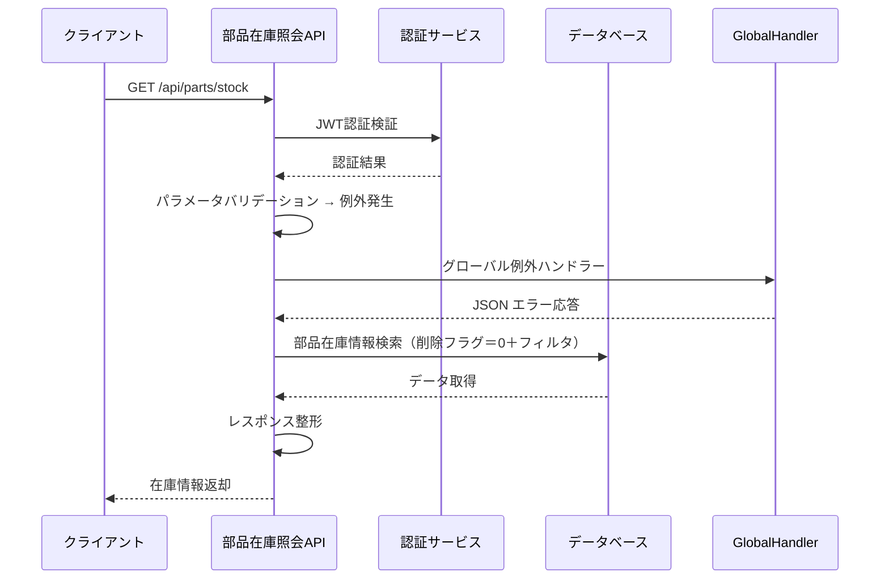

# API 仕様書（部品在庫照会 API）

## 1. API 概要

| 項目           | 内容                       |
| -------------- | -------------------------- |
| **API 名**     | 部品在庫照会 API           |
| **利用者**     | 購買システム、生産システム |
| **更新日**     | 2024 年 12 月 15 日        |
| **バージョン** | 1.0.0                      |

### 1.1 機能概要

- 部品在庫情報の照会
- リアルタイム在庫情報の提供

---

## 2. インターフェース仕様（IF 仕様）

### 2.1 基本情報

- **メソッド**：GET
- **URL**：`/api/parts/stock`
- **認証方式**：JWT Bearer 認証
- **レスポンス形式**：application/json

### 2.2 リクエスト

#### 2.2.1 リクエスト例

```http
GET /api/parts/stock?center_id=1,2&category_id=1,3&name_pattern=ドローン&amount_min=10&amount_max=100
Authorization: Bearer <JWT_TOKEN>
```

#### 2.2.2 リクエストヘッダー

| ヘッダー名    | 必須 | 説明             | 例                 |
| ------------- | ---- | ---------------- | ------------------ |
| Authorization | ○    | JWT 認証トークン | Bearer <JWT_TOKEN> |

#### 2.2.3 クエリパラメータ

| パラメータ名 | 型      | 必須 | 説明                         | 例                     |
| ------------ | ------- | ---- | ---------------------------- | ---------------------- |
| stock_id     | integer | 必須 | 在庫 ID（カンマ区切り）      |  1,2                   |
| category_id  | integer | 任意 | カテゴリ ID（カンマ区切り）  |  1,3                   |
| center_id    | integer | 任意 | センター ID（カンマ区切り）  |  1                     |
| name_pattern | string  | 任意 | 部品名の部分一致検索         | "ドローン"             |
| amount_min   | integer | 任意 | 在庫数量の最小値             |  10                    |
| amount_max   | integer | 任意 | 在庫数量の最大値             |  100                   |

#### 2.2.4 パラメータ検証ルール
- stock_id, category_id, center_id：整数のカンマ区切り。空要素・非数値混在は 400
- amount_min, amount_max：整数。amount_min > amount_max は 400
- date_from, date_to：ISO‑8601。date_from > date_to は 400

### 2.4 レスポンス

#### 2.4.1 成功レスポンス（200 OK）

```json
{
  "status": "success",
  "message": "部品在庫情報を正常に取得しました",
  "data": {
    "items": [
      {
        "stockId": 1,
        "categoryName": "フレーム",
        "centerName": "メインセンター",
        "name": "ドローンフレーム（カーボン製）",
        "amount": 75,
        "description": "カーボン製のドローンフレーム",
        "createDate": "2024-12-15T10:30:15",
        "updateDate": "2024-12-15T14:20:30"
      },
      {
        "stockId": 2,
        "categoryName": "プロペラ",
        "centerName": "メインセンター",
        "name": "ドローンプロペラ（高効率）",
        "amount": 120,
        "description": "高効率ドローン用プロペラ",
        "createDate": "2024-12-14T09:15:30",
        "updateDate": "2024-12-15T11:45:20"
      },
      {
        "stockId": 5,
        "categoryName": "バッテリー",
        "centerName": "西部センター",
        "name": "ドローンバッテリー（リチウム）",
        "amount": 45,
        "description": "長時間駆動リチウムバッテリー",
        "createDate": "2024-12-13T14:22:10",
        "updateDate": "2024-12-15T16:30:45"
      }
    ],
    "total_count": 3
  }
}
```
```json
{
    "status": "success",
    "message": "部品在庫情報を正常に取得しました",
    "data": {
        "items": [
            {
                "name": "一致するデータがありません。"
            }
        ],
        "total_count": 0
    }
}
```

#### 2.4.2 エラーレスポンス

| ステータス | エラーコード    | 説明               |
| ---------- | --------------- | ------------------ |
| 400        | INVALID_REQUEST | パラメータエラー   |
| 401        | UNAUTHORIZED    | 認証エラー         |
| 500        | INTERNAL_ERROR  | システム内部エラー |

#### 2.4.3 エラー例
```json
HTTP/1.1 400 Bad Request
{
  "status": "error",
  "message": "入力が無効です",
  "error_code": "INVALID_REQUEST",
  "details": "amount_min は amount_max 以下で指定してください",
  "timestamp": "2025-07-16T22:32:56.913540900+09:00[Asia/Tokyo]"
}
```
```json
HTTP/1.1 401 Unauthorized
Content-Type: application/json

{
  "message": "Authorization header is missing or incorrect",
  "status": "401",
  "token": null
}

```
```json
HTTP/1.1 500 Internal Server Error
Content-Type: application/json

{
  "status": "error",
  "message": "予期しないエラーが発生しました",
  "error_code": "INTERNAL_ERROR",
  "details": "NullPointerException at PartsStockServiceImpl#search",
  "timestamp": "2025-07-16T22:31:56.715195200+09:00[Asia/Tokyo]"
}
```

| ステータス | エラーコード    | エラーメッセージ   | 説明                                              |
| ---------- | --------------- | ------------------ | ------------------------------------------------  |
| 400        | INVALID_REQUEST | 入力が無効です     | center_id のリストに空または非数値があります      |
| 400        | INVALID_REQUEST | 入力が無効です     | amount_min は amount_max 以下で指定してください   |
| 400        | INVALID_REQUEST | 入力が無効です     | stock_id のリストに空または非数値があります       |
| 400        | INVALID_REQUEST | 入力が無効です     | category_id のリストに空または非数値があります    |
| 400        | INVALID_REQUEST | 入力が無効です     | center_id のリストに空または非数値があります      |
| 400        | INVALID_REQUEST | 入力が無効です     | stock_idは必須項目です。                          |
| 400        | INVALID_REQUEST | 入力が無効です     | 不明なエラー                                      |
| 400        | INVALID_REQUEST | 入力が無効です     | center_id のリストに空または非数値があります      |

## 3. 詳細設計（内部仕様）

### 3.1 処理フロー



### 3.2 バリデーション処理フロー
- SequenceDiagram に「パラメータバリデーション → 例外ハンドリング → グローバル例外ハンドラーで JSON 化」までを明示しておくと、全体像が見えやすくなります。

### 3.3 検索条件 Specification の組み立てロジック
```json
// delete_flag = false
spec = where(ps.deleteFlag == false);
// center_id IN (...)
if (centerId != null) spec = spec.and(ps.centerId in centerId);
// name_pattern LIKE ...
if (namePattern != null) spec = spec.and(lower(ps.name) like %namePattern%);
// …以下略…
```

### 3.4 検索条件 Specification の組み立てロジック
```json
SELECT
  ps.stock_id,
  pci.category_name,
  ci.center_name,
  ps.name,
  …
FROM parts_stock ps
LEFT JOIN parts_category_info pci ON ps.category_id = pci.category_id
LEFT JOIN center_info ci           ON ps.center_id   = ci.center_id
WHERE ps.delete_flag = 0
  AND …（フィルタ条件）…
```

### 3.5 関連ドキュメント

- [共通仕様書](../共通仕様書.md)
- [部品在庫照会 API（OpenAPI 仕様）](./部品在庫照会API.yaml)
- [システム概要書](../../1.APIシステム概要.md)
- [データ設計書](../../../共通/2.データ要件.md)
