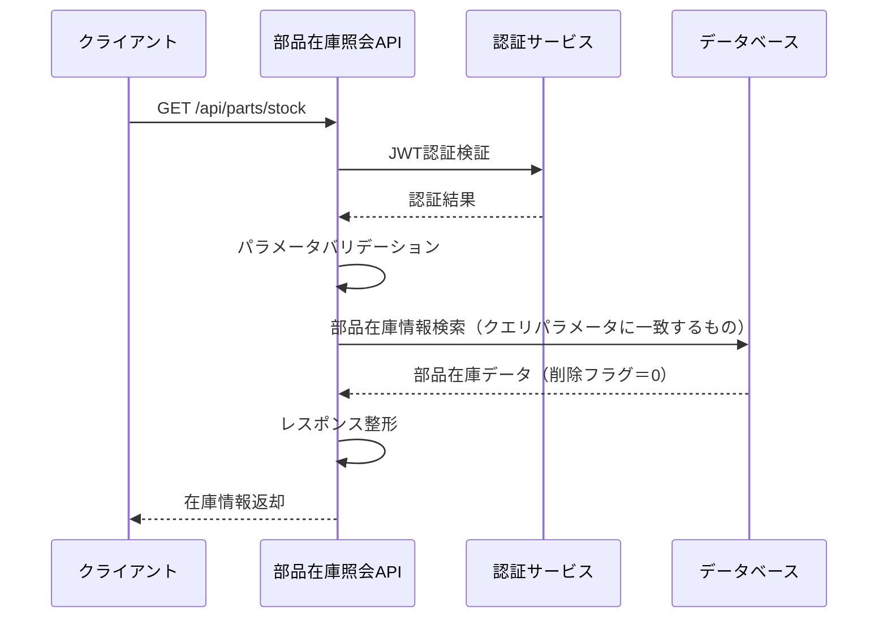

# API 仕様書（部品在庫照会 API）

## 1. API 概要

| 項目           | 内容                       |
| -------------- | -------------------------- |
| **API 名**     | 部品在庫照会 API           |
| **利用者**     | 購買システム、生産システム |
| **更新日**     | 2024 年 12 月 15 日        |
| **バージョン** | 1.0.0                      |

### 1.1 機能概要

- 部品在庫情報の照会
- リアルタイム在庫情報の提供

---

## 2. インターフェース仕様（IF 仕様）

### 2.1 基本情報

- **メソッド**：GET
- **URL**：`/api/parts/stock`
- **認証方式**：JWT Bearer 認証
- **レスポンス形式**：application/json

### 2.2 リクエスト

#### 2.2.1 リクエスト例

```http
GET /api/parts/stock?center_ids=1,2&category_ids=1,3&name_pattern=ドローン&amount_min=10&amount_max=100
Authorization: Bearer <JWT_TOKEN>
```

#### 2.2.2 リクエストヘッダー

| ヘッダー名    | 必須 | 説明             | 例                 |
| ------------- | ---- | ---------------- | ------------------ |
| Authorization | ○    | JWT 認証トークン | Bearer <JWT_TOKEN> |

#### 2.2.3 クエリパラメータ

| パラメータ名 | 型      | 必須 | 説明                         | 例                     |
| ------------ | ------- | ---- | ---------------------------- | ---------------------- |
| center_ids   | string  | 任意 | センター ID（カンマ区切り）  | "1,2"                  |
| category_ids | string  | 任意 | カテゴリ ID（カンマ区切り）  | "1,3"                  |
| stock_id     | string  | 任意 | 在庫 ID（カンマ区切り）      | "1"                    |
| name_pattern | string  | 任意 | 部品名の部分一致検索         | "ドローン"             |
| amount_min   | integer | 任意 | 在庫数量の最小値             | 10                     |
| amount_max   | integer | 任意 | 在庫数量の最大値             | 100                    |
| date_from    | string  | 任意 | 更新日時の開始日（ISO 8601） | "2024-12-01T00:00:00Z" |
| date_to      | string  | 任意 | 更新日時の終了日（ISO 8601） | "2024-12-15T23:59:59Z" |


### 2.4 レスポンス

#### 2.4.1 成功レスポンス（200 OK）

```json
{
  "status": "success",
  "message": "部品在庫情報を正常に取得しました",
  "data": {
    "items": [
      {
        "stock_id": 1,
        "name": "ドローンフレーム（カーボン製）",
        "category_name": "フレーム",
        "center_name": "メインセンター",
        "amount": 75,
        "description": "カーボン製のドローンフレーム",
        "create_date": "2024-12-15T10:30:15Z",
        "update_date": "2024-12-15T14:20:30Z"
      },
      {
        "stock_id": 2,
        "name": "ドローンプロペラ（高効率）",
        "category_name": "プロペラ",
        "center_name": "メインセンター",
        "amount": 120,
        "description": "高効率ドローン用プロペラ",
        "create_date": "2024-12-14T09:15:30Z",
        "update_date": "2024-12-15T11:45:20Z"
      },
      {
        "stock_id": 5,
        "name": "ドローンバッテリー（リチウム）",
        "category_name": "バッテリー",
        "center_name": "西部センター",
        "amount": 45,
        "description": "長時間駆動リチウムバッテリー",
        "create_date": "2024-12-13T14:22:10Z",
        "update_date": "2024-12-15T16:30:45Z"
      }
    ],
    "total_count": 3
  }
}
```

#### 2.4.2 エラーレスポンス

| ステータス | エラーコード    | 説明               |
| ---------- | --------------- | ------------------ |
| 400        | INVALID_REQUEST | パラメータエラー   |
| 401        | UNAUTHORIZED    | 認証エラー         |
| 500        | INTERNAL_ERROR  | システム内部エラー |

---

## 3. 詳細設計（内部仕様）

### 3.1 処理フロー




### 3.5 関連ドキュメント

- [共通仕様書](../共通仕様書.md)
- [部品在庫照会 API（OpenAPI 仕様）](./部品在庫照会API.yaml)
- [システム概要書](../../1.APIシステム概要.md)
- [データ設計書](../../../共通/2.データ要件.md)
